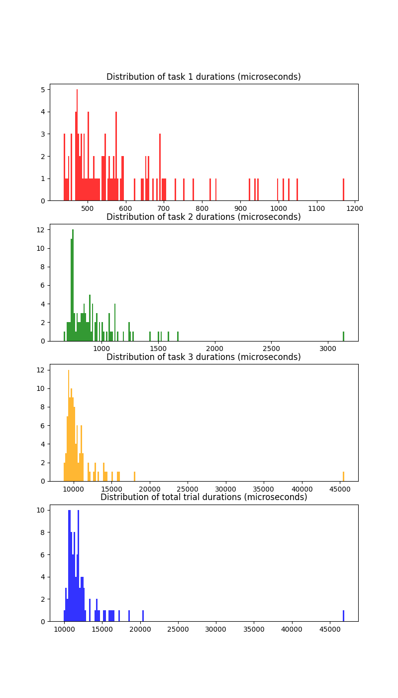

<div align=center>
RESEARCH ASSIGNMENT #2:  <br>
A WEB FRAMEWORK BENCHMARK ANALYSIS
</div>
<br>

<div align=center>

Kevin Geidel <br>
MSDS 436: Analytics Systems Engineering <br>
Northwestern University <br>
October 27, 2024 <br>
</div>
<br>
</p>

### Experimental objectives

<hr>

* Design and conduct a benchmark study comparing two popular web frameworks: Django (Python) and Gin (Go)
* Test throughput and latency during a Monte Carlo performance benchmark with controlled queries using SQLite
* Control for the use of ORMs in each framework
* n=100 for each query task
* Generate response distributions and averages for each task
* Display and summarize results

### Included directories and files

<hr>


### Experimental design

<hr>

According to Quora's AI bot (Assistant 2024) a Monte Carlo performance benchmark must have a defined problem, model, reference data and established metrics. Each framework must answer ....

(INCLUDE "TREATMENT CONDITIONS" AND DATA)

The dataset used for the benchmark is a collection of every tic-tac-toe end state (van Rijn 2014). There are 958 records and 10 attributes (the state of each of the nine squares plus a boolean representing if 'X', who moves first, is victorious or not.) 

QUERY TASKS:


* Logical combinations of conditionals: return all end states in which either side is victorious using a diagonal
* Aggregation in queries: calculate the percentage of end states in which 'X' is victorious.
* Aggregation in loops: given each square a point value based on its position (top-left is 1 and bottom-right is 9) sum each side's total "score" over all records.


### Installing and running the benchmark

<hr>

```shell
# Clone and enter the repo
git clone git@github.com:kgeidel/MSDS-436-Research-Assignment-2.git
cd MSDS-436-Research-Assignment-2


```

### Troubleshooting

<hr>

If you are unable to install and run the benchmark experiment there are a few things you can try.

```shell
# The repo contains a copy of the dataset but if, for some reason, it cannot be found you can obtain it from the web (run this command from the project repo root!)
wget https://www.openml.org/data/download/50/dataset_50_tic-tac-toe.arff -P data

# The repo contains the SQLite file (mc_benchmark/db.sqlite3) if there is an issue with this file you can create a fresh one using setup.ipynb
# if you have jupyter installed you can try:
jupyter nbconvert --execute setup.ipynb
# Alternatively, you can open the notebook and run all cells!
```

### Experimental results

<hr>

* [Table 1: Django benchmark results](#table-1-django-benchmark-results-n100)
* [Figure 1: Django benchmark trial distributions](#figure-1-django-benchmark-trial-distributions)
* [Table 3: Summary of results](#table-3-summary-of-results)

The Django framework is the first tested. The Jupyter notebook found at `mc_benchmark/django_benchmark.ipynb` can be executed to run the experiment and display results. Each time you run the experiment there is, obviously, variation in the exact numbers. Here is, however, data from one such experiment.

#### Table 1: Django benchmark results (n=100)

|     |   task_1_duration |   task_1_results |   task_2_duration | task_2_results   |   task_3_duration | task_3_results           |   total_microseconds |
|----:|------------------:|-----------------:|------------------:|:-----------------|------------------:|:-------------------------|---------------------:|
|  1 |              1172 |    8765561657036 |              3143 | 65.34%           |             10010 | {'X': 18210, 'O': 15000} |                14325 |
|   2 |               507 |    8765559809986 |               958 | 65.34%           |             11023 | {'X': 18210, 'O': 15000} |                12488 |
|   3 |               543 |    8765559716914 |               777 | 65.34%           |              9738 | {'X': 18210, 'O': 15000} |                11058 |
|   4 |               503 |    8765561643403 |               940 | 65.34%           |              9410 | {'X': 18210, 'O': 15000} |                10853 |
|   5 |               690 |    8765559717115 |               984 | 65.34%           |             10254 | {'X': 18210, 'O': 15000} |                11928 |
|   6 |               492 |    8765559717163 |               841 | 65.34%           |              9772 | {'X': 18210, 'O': 15000} |                11105 |
|   7 |               473 |    8765559717352 |               738 | 65.34%           |              8722 | {'X': 18210, 'O': 15000} |                 9933 |
|   8 |               451 |    8765559717493 |               898 | 65.34%           |              9247 | {'X': 18210, 'O': 15000} |                10596 |
|   9 |               438 |    8765559717622 |               800 | 65.34%           |              9283 | {'X': 18210, 'O': 15000} |                10521 |
|  10 |               516 |    8765559717748 |               712 | 65.34%           |              9549 | {'X': 18210, 'O': 15000} |                10777 |
|  11 |               471 |    8765559717883 |               740 | 65.34%           |             10029 | {'X': 18210, 'O': 15000} |                11240 |
|  12 |               659 |    8765559717280 |               750 | 65.34%           |              9093 | {'X': 18210, 'O': 15000} |                10502 |
|  13 |               448 |    8765559717343 |               736 | 65.34%           |              8985 | {'X': 18210, 'O': 15000} |                10169 |
|  14 |               445 |    8765559712887 |               699 | 65.34%           |              9684 | {'X': 18210, 'O': 15000} |                10828 |
|  15 |               438 |    8765559712863 |               923 | 65.34%           |             13935 | {'X': 18210, 'O': 15000} |                15296 |
|  16 |               938 |    8765559713007 |              1531 | 65.34%           |             12797 | {'X': 18210, 'O': 15000} |                15266 |
|  17 |               660 |    8765559713121 |              1241 | 65.34%           |              9746 | {'X': 18210, 'O': 15000} |                11647 |
|  18 |               750 |    8765559713310 |              1240 | 65.34%           |              9402 | {'X': 18210, 'O': 15000} |                11392 |
|  19 |               471 |    8765559713448 |               741 | 65.34%           |             10091 | {'X': 18210, 'O': 15000} |                11303 |
|  20 |               484 |    8765559713580 |               750 | 65.34%           |              9449 | {'X': 18210, 'O': 15000} |                10683 |
|  21 |               729 |    8765559713712 |              1278 | 65.34%           |              9954 | {'X': 18210, 'O': 15000} |                11961 |
|  22 |               651 |    8765559713067 |               828 | 65.34%           |             10463 | {'X': 18210, 'O': 15000} |                11942 |
|  23 |               481 |    8765559713571 |               877 | 65.34%           |              9592 | {'X': 18210, 'O': 15000} |                10950 |
|  24 |               838 |    8765559727190 |              1259 | 65.34%           |              9697 | {'X': 18210, 'O': 15000} |                11794 |
|  25 |               622 |    8765559727145 |               745 | 65.34%           |             10200 | {'X': 18210, 'O': 15000} |                11567 |
|  26 |               527 |    8765559727313 |              1124 | 65.34%           |             10232 | {'X': 18210, 'O': 15000} |                11883 |
|  27 |               520 |    8765559727475 |               758 | 65.34%           |              9357 | {'X': 18210, 'O': 15000} |                10635 |
|  28 |               539 |    8765559727607 |               728 | 65.34%           |             11252 | {'X': 18210, 'O': 15000} |                12519 |
|  29 |               494 |    8765559727742 |               844 | 65.34%           |             45562 | {'X': 18210, 'O': 15000} |                46900 |
|  30 |               657 |    8765559727748 |               820 | 65.34%           |             10576 | {'X': 18210, 'O': 15000} |                12053 |
|  31 |               595 |    8765559727970 |               916 | 65.34%           |              9503 | {'X': 18210, 'O': 15000} |                11014 |
|  32 |               670 |    8765559728090 |               900 | 65.34%           |             11276 | {'X': 18210, 'O': 15000} |                12846 |
|  33 |               640 |    8765559727496 |               850 | 65.34%           |             15830 | {'X': 18210, 'O': 15000} |                17320 |
|  34 |              1012 |    8765559728078 |              1670 | 65.34%           |             15935 | {'X': 18210, 'O': 15000} |                18617 |
|  35 |               571 |    8765559706722 |              1075 | 65.34%           |              9898 | {'X': 18210, 'O': 15000} |                11544 |
|  36 |               478 |    8765559727946 |               748 | 65.34%           |              9170 | {'X': 18210, 'O': 15000} |                10396 |
|  37 |               585 |    8765559706908 |              1120 | 65.34%           |              9358 | {'X': 18210, 'O': 15000} |                11063 |
|  38 |               574 |    8765559707028 |               741 | 65.34%           |              9660 | {'X': 18210, 'O': 15000} |                10975 |
|  39 |               459 |    8765559707160 |               787 | 65.34%           |              9335 | {'X': 18210, 'O': 15000} |                10581 |
|  40 |               474 |    8765559707301 |              1065 | 65.34%           |              9877 | {'X': 18210, 'O': 15000} |                11416 |
|  41 |               485 |    8765559707436 |               750 | 65.34%           |              9971 | {'X': 18210, 'O': 15000} |                11206 |
|  42 |               478 |    8765559707571 |               742 | 65.34%           |              9507 | {'X': 18210, 'O': 15000} |                10727 |
|  43 |               518 |    8765559706830 |              1078 | 65.34%           |             10184 | {'X': 18210, 'O': 15000} |                11780 |
|  44 |               574 |    8765559707349 |               733 | 65.34%           |              9844 | {'X': 18210, 'O': 15000} |                11151 |
|  45 |               472 |    8765559739460 |              1050 | 65.34%           |              9475 | {'X': 18210, 'O': 15000} |                10997 |
|  46 |               779 |    8765561619827 |               839 | 65.34%           |             10611 | {'X': 18210, 'O': 15000} |                12229 |
|  47 |               470 |    8765559739643 |               735 | 65.34%           |             11113 | {'X': 18210, 'O': 15000} |                12318 |
|  48 |               546 |    8765559739763 |               853 | 65.34%           |              9942 | {'X': 18210, 'O': 15000} |                11341 |
|  49 |               688 |    8765559739895 |               859 | 65.34%           |             10031 | {'X': 18210, 'O': 15000} |                11578 |
|  50 |               501 |    8765559740036 |               747 | 65.34%           |             10508 | {'X': 18210, 'O': 15000} |                11756 |
|  51 |               509 |    8765559740168 |               739 | 65.34%           |              9487 | {'X': 18210, 'O': 15000} |                10735 |
|  52 |               478 |    8765559740303 |               824 | 65.34%           |              9040 | {'X': 18210, 'O': 15000} |                10342 |
|  53 |               480 |    8765559739448 |               695 | 65.34%           |              9710 | {'X': 18210, 'O': 15000} |                10885 |
|  54 |               559 |    8765559739793 |               811 | 65.34%           |             11221 | {'X': 18210, 'O': 15000} |                12591 |
|  55 |               577 |    8765559739904 |               920 | 65.34%           |             11939 | {'X': 18210, 'O': 15000} |                13436 |
|  56 |              1026 |    8765559736445 |              1430 | 65.34%           |              9452 | {'X': 18210, 'O': 15000} |                11908 |
|  57 |               487 |    8765559736409 |               848 | 65.34%           |             11016 | {'X': 18210, 'O': 15000} |                12351 |
|  58 |               823 |    8765559736571 |              1117 | 65.34%           |             12220 | {'X': 18210, 'O': 15000} |                14160 |
|  59 |               569 |    8765559736754 |               751 | 65.34%           |             10533 | {'X': 18210, 'O': 15000} |                11853 |
|  60 |               593 |    8765559736880 |              1091 | 65.34%           |              9516 | {'X': 18210, 'O': 15000} |                11200 |
|  61 |               540 |    8765559737021 |               736 | 65.34%           |             10085 | {'X': 18210, 'O': 15000} |                11361 |
|  62 |               557 |    8765559737144 |               952 | 65.34%           |              9285 | {'X': 18210, 'O': 15000} |                10794 |
|  63 |               703 |    8765559737279 |               749 | 65.34%           |              9159 | {'X': 18210, 'O': 15000} |                10611 |
|  64 |               591 |    8765559736733 |               803 | 65.34%           |              9440 | {'X': 18210, 'O': 15000} |                10834 |
|  65 |               469 |    8765559737009 |               885 | 65.34%           |              9160 | {'X': 18210, 'O': 15000} |                10514 |
|  66 |               576 |    8765559725139 |               942 | 65.34%           |              9110 | {'X': 18210, 'O': 15000} |                10628 |
|  67 |               493 |    8765559725115 |               825 | 65.34%           |             13270 | {'X': 18210, 'O': 15000} |                14588 |
|  68 |               682 |    8765559725331 |              1142 | 65.34%           |             10772 | {'X': 18210, 'O': 15000} |                12596 |
|  69 |               543 |    8765559725379 |               742 | 65.34%           |              9010 | {'X': 18210, 'O': 15000} |                10295 |
|  70 |               439 |    8765559725574 |               732 | 65.34%           |              9486 | {'X': 18210, 'O': 15000} |                10657 |
|  71 |               651 |    8765559725715 |               916 | 65.34%           |              9689 | {'X': 18210, 'O': 15000} |                11256 |
|  72 |               545 |    8765559725847 |               743 | 65.34%           |              9208 | {'X': 18210, 'O': 15000} |                10496 |
|  73 |               450 |    8765559725982 |               667 | 65.34%           |             10754 | {'X': 18210, 'O': 15000} |                11871 |
|  74 |               552 |    8765559725142 |               759 | 65.34%           |             12881 | {'X': 18210, 'O': 15000} |                14192 |
|  75 |               946 |    8765559725679 |               896 | 65.34%           |             12627 | {'X': 18210, 'O': 15000} |                14469 |
|  76 |               998 |    8765559725454 |              1589 | 65.34%           |             13884 | {'X': 18210, 'O': 15000} |                16471 |
|  77 |               485 |    8765559756910 |               876 | 65.34%           |             10423 | {'X': 18210, 'O': 15000} |                11784 |
|  78 |              1049 |    8765559756952 |              1074 | 65.34%           |             10099 | {'X': 18210, 'O': 15000} |                12222 |
|  79 |               472 |    8765559757147 |               813 | 65.34%           |             15051 | {'X': 18210, 'O': 15000} |                16336 |
|  80 |               690 |    8765559757282 |              1119 | 65.34%           |             14127 | {'X': 18210, 'O': 15000} |                15936 |
|  81 |               570 |    8765559757411 |               957 | 65.34%           |             10430 | {'X': 18210, 'O': 15000} |                11957 |
|  82 |               565 |    8765559757543 |               882 | 65.34%           |             11956 | {'X': 18210, 'O': 15000} |                13403 |
|  83 |               524 |    8765559757678 |               855 | 65.34%           |              9981 | {'X': 18210, 'O': 15000} |                11360 |
|  84 |               645 |    8765559757816 |              1199 | 65.34%           |             14311 | {'X': 18210, 'O': 15000} |                16155 |
|  85 |               531 |    8765559757258 |               837 | 65.34%           |             10269 | {'X': 18210, 'O': 15000} |                11637 |
|  86 |               502 |    8765559757819 |              1026 | 65.34%           |             11036 | {'X': 18210, 'O': 15000} |                12564 |
|  87 |               472 |    8765559628907 |               986 | 65.34%           |              9338 | {'X': 18210, 'O': 15000} |                10796 |
|  88 |               702 |    8765559628883 |               764 | 65.34%           |              9888 | {'X': 18210, 'O': 15000} |                11354 |
|  89 |               512 |    8765559629105 |               781 | 65.34%           |              9449 | {'X': 18210, 'O': 15000} |                10742 |
|  90 |               501 |    8765559629216 |               782 | 65.34%           |              9605 | {'X': 18210, 'O': 15000} |                10888 |
|  91 |               458 |    8765559629348 |               894 | 65.34%           |              9687 | {'X': 18210, 'O': 15000} |                11039 |
|  92 |               547 |    8765559629489 |               738 | 65.34%           |              9667 | {'X': 18210, 'O': 15000} |                10952 |
|  93 |               560 |    8765559629624 |               714 | 65.34%           |              8860 | {'X': 18210, 'O': 15000} |                10134 |
|  94 |               459 |    8765559629759 |               717 | 65.34%           |             10944 | {'X': 18210, 'O': 15000} |                12120 |
|  95 |               579 |    8765559629135 |               743 | 65.34%           |             11028 | {'X': 18210, 'O': 15000} |                12350 |
|  96 |               926 |    8765559629774 |              1498 | 65.34%           |             17943 | {'X': 18210, 'O': 15000} |                20367 |
|  97 |               592 |    8765559648336 |              1012 | 65.34%           |             10097 | {'X': 18210, 'O': 15000} |                11701 |
|  98 |               698 |    8765559648348 |               906 | 65.34%           |             10122 | {'X': 18210, 'O': 15000} |                11726 |
|  99 |               492 |    8765559648525 |               892 | 65.34%           |             10858 | {'X': 18210, 'O': 15000} |                12242 |
| 100 |               498 |    8765559648645 |              1006 | 65.34%           |             10522 | {'X': 18210, 'O': 15000} |                12026 |

#### Figure 1: Django benchmark trial distributions



#### Table 2: Gin benchmark results (n=100)

#### Table 3: Summary of results

The two frameworks are compared in the summary below. These are statistical descriptions of the durations for each task and trial. **All units (except for count) are in microseconds.**

| Task |       | Django (Python) | Gin (Go) |
| ---: | ----: | --------------: | -------: |
|      | count | 100             |          |
|  1   | avg | 590.41     |          |
|      | std | 153.43     |          |
|      | min | 438.00     |          |
|      | 25% | 484.75     |          |
|      | 50% | 544.00     |          |
|      | 75% | 651.00     |          |
|      | max | 1172.00    |          |
| 2    | avg | 930.36     |          |
|      | std | 304.49     |          |
|      | min | 667.00     |          |
|      | 25% | 748.75     |          |
|      | 50% | 849.00     |          |
|      | 75% | 991.00     |          |
|      | max | 3143.00    |          |
| 3    | avg | 10857.77   |          |
|      | std | 3886.12    |          |
|      | min | 8722.00    |          |
|      | 25% | 9483.25    |          |
|      | 50% | 9976.00    |          |
|      | 75% | 10879.50   |          |
|      | max | 45562.00   |          |
| total | avg  | 12378.54 |          |
|      | std  | 3952.32   |          |
|      | min  | 9933.00   |          |
|      | 25%  | 10848.25  |          |
|      | 50%  | 11555.50  |          |
|      | 75%  | 12326.00  |          |
|      | max  | 46900.00  |          |

### Conclusions

<hr>

(RECOMMENDATIONS FOR MANAGEMENT- WHICH FRAMEWORK TO USE?)

### References

<hr>

<div style="padding-left: 1.5em; text-indent: -1.5em">
Assistant. “How Do You Create a Benchmark for Testing Monte Carlo Simulation Against?” Quora, August 16, 2024. https://www.quora.com/How-do-you-create-a-benchmark-for-testing-Monte-Carlo-simulation-against. 

<br>

Rijn, Jan van. “Tic-Tac-Toe.” OpenML, April 6, 2014. https://www.openml.org/search?type=data&status=active&id=50. 


</div>